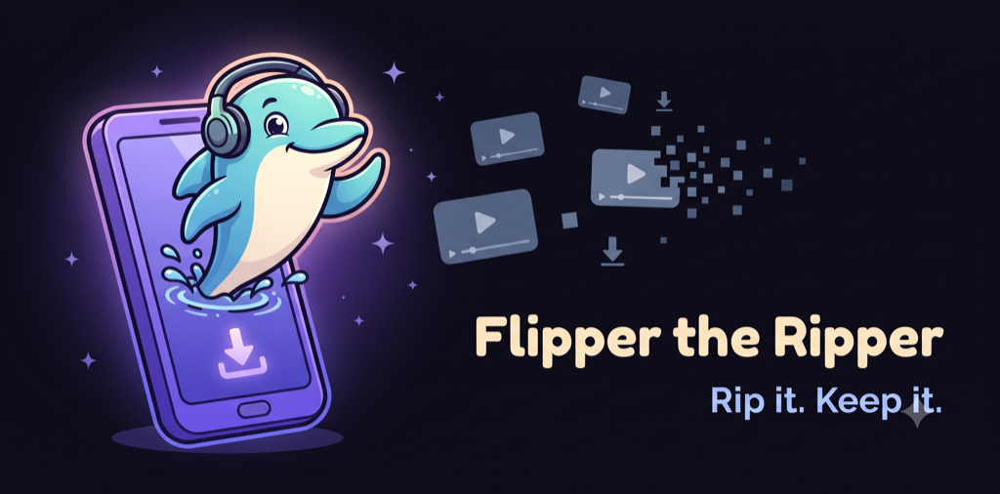
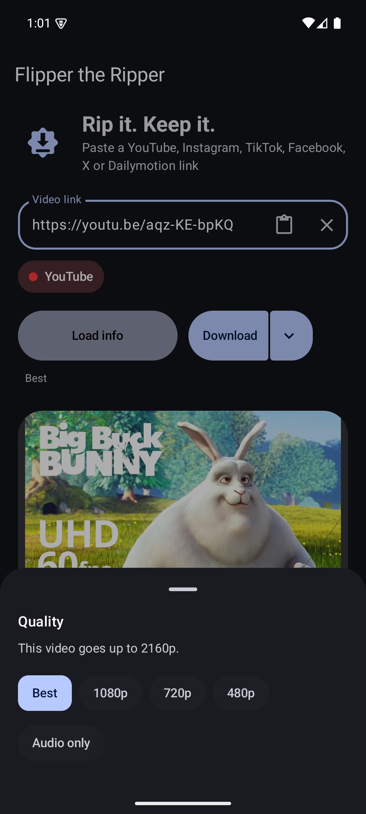
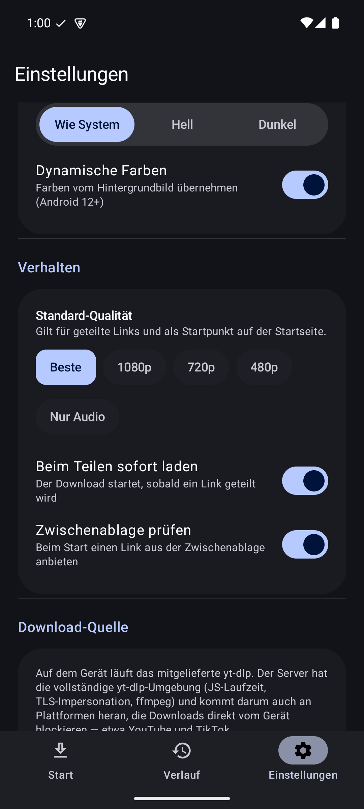
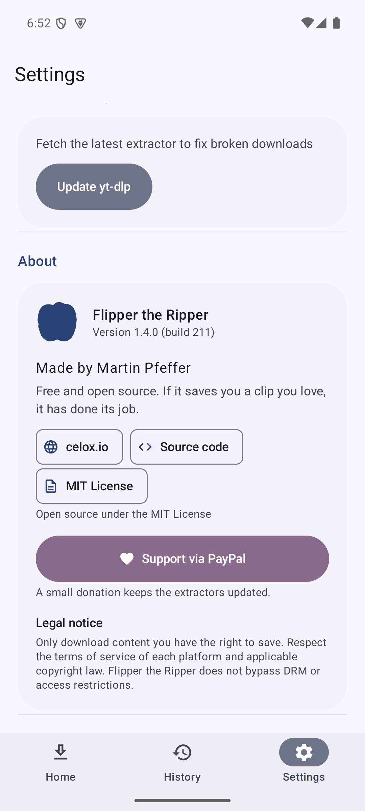
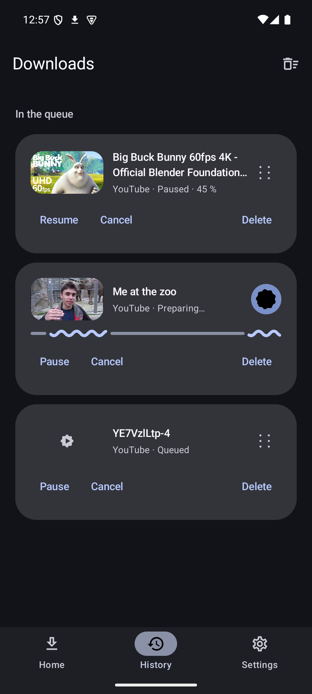
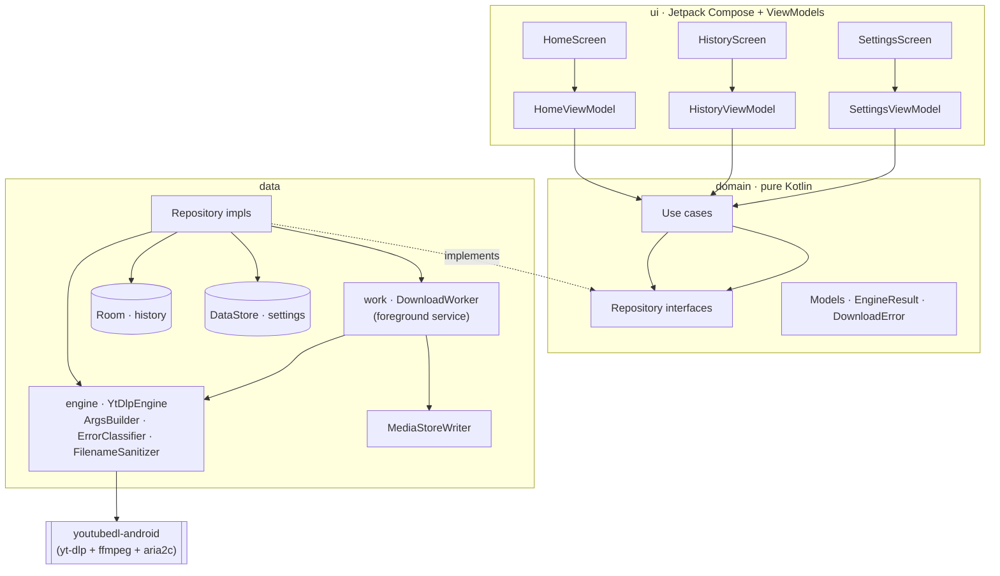

<div align="center">



# 🎬 Flipper the Ripper

**A modern, open-source Android app to download publicly accessible videos from Instagram, YouTube, TikTok and Facebook.**

[](https://github.com/pepperonas/flipper-the-ripper/actions/workflows/ci.yml)
[](https://github.com/pepperonas/flipper-the-ripper/actions/workflows/ci.yml)
[](https://github.com/pepperonas/flipper-the-ripper/actions/workflows/ci.yml)
[](https://kotlinlang.org)
[](https://developer.android.com/jetpack/compose)
[](https://developer.android.com/tools/releases/platforms)
[](https://github.com/pepperonas/flipper-the-ripper/releases/latest)
[](https://github.com/pepperonas/flipper-the-ripper/releases)
[](https://github.com/pepperonas/flipper-the-ripper/actions/workflows/release.yml)
[](LICENSE)

</div>

---

> [!IMPORTANT]
> **Only download content you have the right to save.** Flipper the Ripper is intended for
> **publicly accessible** content and for personal, lawful use. It does **not** bypass DRM,
> paywalls, or access restrictions. Please respect the terms of service of each platform and
> applicable copyright law. See [Legal & responsible use](#-legal--responsible-use).

## 📸 Screenshots

Material 3 **Expressive** UI with spring physics, shape-morphing motifs and dynamic color — in dark and light.

| Home (dark) | Settings (dark) | Settings (light) | History |
|:---:|:---:|:---:|:---:|
|  |  |  |  |

## ✨ Features

- **Share integration** — tap *Share* in Instagram / TikTok / YouTube / Facebook and pick **Flipper the Ripper**; the link is imported automatically.
- **Clipboard detection** — copied a link instead? On launch the app offers to download a supported URL found on the clipboard.
- **One-tap flow** — analyse → detect platform → resolve metadata → download, with as few taps as possible (auto-download on share is configurable).
- **Instagram sign-in (optional)** — some reels are only visible to a signed-in account. Sign in on **Instagram's own page** (*Settings → Instagram*) and the app can download the reels *your* account can see. The password is entered on Instagram, never touched by the app — only the resulting session cookie is kept, exactly as a browser does. Sign out anytime.
- **Title-based filenames** — files are named after the video title (`Wie man Android Apps entwickelt.mp4`) with illegal characters sanitised.
- **Shows up everywhere** — saved via **MediaStore** into the public *Movies* folder; instantly visible in Gallery, Google Photos and file managers.
- **True background downloads** — keep going while the screen is locked, the app is minimised, or the device is rotated (WorkManager + foreground service).
- **Audio-only mode** for YouTube (`.m4a`).
- **Robust error messages** — private video, login required, region blocked, rate-limited, network error, invalid link, cancelled.
- **Material 3 Expressive** — spring-based motion physics (`MotionScheme.expressive()`), shape-morphing `MaterialShapes` motifs, the expressive `LoadingIndicator`, emphasized typography, a spring-sliding segmented toggle, staggered list entrances, and expressive screen transitions. Dynamic color + light/dark, all guarded by `prefers-reduced-motion`.
- **Update the engine** in-app to fix broken extractors.

## 📥 Download

Grab the latest signed APK from the [**Releases**](https://github.com/pepperonas/flipper-the-ripper/releases/latest) page and sideload it. Pick the APK for your CPU:

| APK | For |
|-----|-----|
| `flipper-the-ripper-<version>-arm64-v8a.apk` | **Virtually all modern phones** (64-bit ARM) — pick this if unsure |
| `flipper-the-ripper-<version>-armeabi-v7a.apk` | Older 32-bit ARM devices |

> Each build ships as a **per-ABI APK** (~33 MB) instead of one fat ~74 MB APK — you only download
> the native engine (yt-dlp + ffmpeg) for your architecture. Both architectures stay fully supported.
>
> Not on Google Play by design — the Play Store prohibits video-downloader apps and runtime binary
> updates. Distribution is via GitHub Releases / F-Droid-style sideloading (like NewPipe and Seal).

## 🧠 The download engine — and why

Flipper the Ripper reuses the **policy and stability logic** of the desktop project
[`inspector-rust`](https://github.com/pepperonas) and runs it on Android.

`inspector-rust` is a Tauri desktop app that shells out to the external **`yt-dlp`** + **`ffmpeg`**
CLIs — there is no in-app extraction engine, and **stock Android cannot execute a `yt-dlp` binary
or run Python**. A literal 1:1 port is therefore impossible. What *is* portable is the thin policy
layer, which this app reimplements faithfully in Kotlin:

- **Platform detection** (host-substring match) → [`UrlParser`](app/src/main/kotlin/io/celox/flipperripper/domain/util/UrlParser.kt)
- **yt-dlp argument strategy** — prefer H.264 + m4a → mp4 for universal playback, audio = m4a q0, `--no-playlist`/`--no-mtime`, YouTube SABR workaround `player_client=default,ios,web_safari`, the `--` flag-injection guard, `%(title).100B [%(id)s]` naming → [`YtDlpArgsBuilder`](app/src/main/kotlin/io/celox/flipperripper/data/engine/YtDlpArgsBuilder.kt)
- **Error taxonomy** — `is_bot_block` / `looks_stale_or_rate_limited` plus private/region/unavailable/network buckets → [`ErrorClassifier`](app/src/main/kotlin/io/celox/flipperripper/data/engine/ErrorClassifier.kt)

The engine underneath is [**youtubedl-android**](https://github.com/JunkFood02/youtubedl-android),
which bundles the **real yt-dlp + ffmpeg + aria2c** as native libraries — the same engine that
powers apps like Seal. So the ported policy layer drives the *identical* extractor, giving the
same reliability across all three platforms.

### Decision: reuse vs. JNI vs. re-port

| Option | Verdict |
|--------|---------|
| **Port the Rust as a native lib (JNI)** | ❌ Not useful — `inspector-rust`'s core is an `rlib` (no `cdylib`) and contains **no extraction code**, only a ~50-line subprocess wrapper around external CLIs. Nothing to port. |
| **Subprocess yt-dlp (as on desktop)** | ❌ Impossible on non-rooted Android (no Python, no arbitrary `exec`). |
| **Bundle yt-dlp via youtubedl-android** ✅ | **Chosen.** Ships the real yt-dlp as a native payload; reuses the desktop policy layer verbatim; self-updates at runtime. Trade-off: larger APK (~70 MB) and ARM-only. |
| Pure-JVM extractor (NewPipeExtractor) | ❌ Strong for YouTube only; Instagram unsupported, TikTok fragile — would not meet the requirement. |

**Cookie fallback deviation:** the desktop `--cookies-from-browser` retry has no Android equivalent
(there are no desktop browser profiles). For Instagram the app instead offers an **in-app sign-in**
(*Settings → Instagram*): a WebView loads Instagram's own login page and the shared cookie store then
carries the session into the extractor — see [How downloads are routed](#how-downloads-are-routed).
Login walls that remain (e.g. YouTube age-gates) are surfaced as a typed `LoginRequired` error.

## 🏛️ Architecture

Clean Architecture + MVVM, single Gradle module with strictly layered packages (the `domain` layer
has **zero** Android dependencies and is 100%-unit-testable).



**Why WorkManager + a foreground service?** Downloads can take minutes and must survive process
death, minimisation and rotation. A bare service wouldn't give persistence, constraints, retry or
observable progress; WorkManager provides all of that and runs a foreground (`dataSync`) service
under the hood for the long-running case.

### Tech stack

Kotlin 2.0 · Jetpack Compose + **Material 3 Expressive** (material3 1.5.0-alpha, `graphics-shapes`) ·
MVVM + Clean Architecture · Coroutines + Flow · Hilt · Navigation Compose · Room · DataStore ·
WorkManager · Kotlin Serialization · Coil · youtubedl-android · **no XML layouts**.

> The Expressive component + motion APIs (`MotionScheme`, `MaterialShapes`, `LoadingIndicator`) are
> currently in the `material3:1.5.0-alpha` line, pinned explicitly (no Compose BOM) to the
> Compose 1.11 set that still targets `compileSdk 35` / AGP 8.7.

## 🛠️ Build

**Requirements:** JDK 17, Android SDK (compile/target **35**), Android Studio Ladybug+ (optional).

```bash
git clone https://github.com/pepperonas/flipper-the-ripper.git
cd flipper-the-ripper

./gradlew assembleDebug          # debug APK → app/build/outputs/apk/debug/
./gradlew testDebugUnitTest      # unit tests
./gradlew koverVerifyDebug       # coverage gate (≥ 80% line coverage)
./gradlew spotlessCheck detekt   # formatting + static analysis
./gradlew connectedDebugAndroidTest   # instrumentation tests (device/emulator, ARM image)
```

> The emulator must use an **ARM system image** — the bundled yt-dlp native libraries ship for
> `arm64-v8a` / `armeabi-v7a` only (no x86/x86_64).

### Signed release builds

Signing is wired via `keystore.properties` (local, git-ignored) with an environment-variable
fallback for CI. See [Signing](#-signing).

```bash
./gradlew assembleRelease        # signed APK → app/build/outputs/apk/release/
```

## 🔏 Signing

Signing secrets are **never** committed (`*.jks`, `keystore.properties` are git-ignored).

- **Locally:** place `release.jks` + `keystore.properties` (`storeFile`, `storePassword`,
  `keyAlias`, `keyPassword`) in the project root.
- **CI / GitHub Actions:** the release workflow decodes the keystore from the `KEYSTORE_BASE64`
  secret and reads `KEYSTORE_PASSWORD`, `KEY_ALIAS`, `KEY_PASSWORD`. The build's signing config
  falls back to these environment variables when `keystore.properties` is absent.

## 🚀 Releases

Releases are automated. Pushing a `v*` tag triggers the
[release workflow](.github/workflows/release.yml), which builds a signed APK and publishes a
GitHub Release with notes.

```bash
# bump versionCode/versionName in app/build.gradle.kts, commit, then:
git tag v1.0.1 && git push origin v1.0.1
```

Versioning follows [Semantic Versioning](https://semver.org/).

## 🗺️ Roadmap

- [x] Instagram sign-in for login-only reels (in-app WebView login → session reused by the extractor) — shipped in 1.2.11
- [ ] User-supplied cookie file for other login-gated platforms
- [ ] Playlist / multi-item downloads
- [ ] Quality / format picker before download
- [ ] Subtitle download
- [ ] Download queue management (pause/resume, reorder)
- [ ] F-Droid distribution
- [ ] Additional platforms supported by yt-dlp (opt-in)
- [ ] Bundle a JS runtime + PO-token provider + `curl_cffi` impersonation to fully cover YouTube/TikTok (see Known limitations)

## ❓ FAQ

**Is this on Google Play?** No — Play policy prohibits these apps. Sideload the signed APK from Releases.

**Why is the APK ~33 MB?** Each build is a **per-ABI APK** carrying only your architecture's copy of the real yt-dlp + ffmpeg native libraries (a single fat APK would be ~70 MB), so extraction works fully offline of any server.

**A download fails with "rate-limited or out of date".** The extractor changed upstream. Open **Settings → Update yt-dlp** to fetch the latest engine, then retry.

**An Instagram reel won't download / says it needs sign-in.** Some reels are only visible to a logged-in account. Go to **Settings → Instagram → Sign in to Instagram**, sign in on Instagram's own page, then retry. If your account can view the reel, the app can download it; a private account you don't follow stays inaccessible (that is Instagram's rule, not an app limit).

**YouTube says login/age-verification required.** That content is behind an auth/anti-bot wall that the app does not bypass; only content reachable without those walls is supported.

**Do TikTok and Facebook work?** Yes — both download on-device through the WebView (TikTok reads the URL from the page's rehydration JSON; Facebook from the public video page's HTML). Facebook videos that require a login, and private/age-restricted content, are not supported.

**Where do files go?** The public *Movies/FlipperTheRipper* folder (audio → *Music/FlipperTheRipper*), visible in Gallery/Photos/file managers.

**Does it work on an x86 emulator?** No — use an ARM system image or a physical device.

## 🧯 Troubleshooting

| Symptom | Fix |
|---------|-----|
| "The download engine is still initialising" | First launch unpacks the native payload; wait a few seconds and retry. |
| Downloads don't start in the background | Allow notifications and disable battery optimisation for the app. |
| Repeated failures on one platform | **Settings → Update yt-dlp**. |
| Nothing saved to the gallery | Check storage; on Android 7–9 grant the storage permission when prompted. |
| Build fails on `kspDebugKotlin` | Ensure `ksp.useKSP2=false` (set in `gradle.properties`). |
| A YouTube/TikTok download fails after the title/thumbnail loaded | The platform is gating the media fetch — see **How downloads are routed** below. Try **Settings → Update yt-dlp**, and switch download source: on-device uses your own IP, which YouTube blocks far less than a server's. |
| "Your IP address is blocked" / "Sign in to confirm you're not a bot" | Platform-side IP reputation, not an app fault. Switch to **On device** (your own connection) or try a different network. |
| An Instagram reel fails / `HTTP 403 from …cdninstagram.com` | The reel is login-only. **Settings → Instagram → Sign in to Instagram**, then retry. A 403 after signing in usually means your account can't view that reel (private account you don't follow). |

### How downloads are routed

The app picks the right engine per platform automatically — you do not choose a source by hand — and
falls back to a configured server if the primary can't get it:

| Platform | On-device primary | Why | Fallback |
|----------|-------------------|-----|----------|
| **YouTube** | bundled **yt-dlp** (`android_vr` client) | needs no JS challenge, no PO token; runs from *your* IP, which YouTube blocks far less than a datacenter | server |
| **Instagram** | a hidden **WebView** (+ optional sign-in) | Instagram fingerprints the TLS handshake and hydrates the URL with JS — only a real browser gets through, and Android's WebView *is* Chromium; signing in unlocks login-only reels | server |
| **TikTok** | a hidden **WebView** | same browser check; the URL is read from the page's `__UNIVERSAL_DATA_FOR_REHYDRATION__` JSON and fetched with a `tiktok.com` Referer + the page cookies | server |
| **Facebook** | a hidden **WebView** (desktop UA) | the public video page embeds `browser_native_hd_url` in its HTML — but only the *desktop* page, so the extractor presents a desktop user-agent | server |

**How the engines differ:**

- **yt-dlp on the device** has no JavaScript runtime and no `curl_cffi`, so it can do YouTube (via
  `android_vr`) but *cannot* do Instagram/TikTok/Facebook at all — those require browser TLS impersonation.
- **The WebView** is real Chromium: it presents the genuine Chrome TLS fingerprint and runs the page's
  JS, then reads the direct video URL — each platform hides it differently:
  - **Instagram** — public reels are scraped from the embed's hydrated JSON; signed-in/gated reels go
    through Instagram's own media API (`/api/v1/media/<id>/info/`, media id derived from the shortcode),
    called *from inside the page* so it is same-origin: it carries your session, uses Chromium's TLS,
    isn't CORS-blocked, and returns the **authorized** URL (the embed's URL 403s for gated content).
  - **TikTok** — parsed out of the page's `__UNIVERSAL_DATA_FOR_REHYDRATION__` JSON (`video.playAddr`).
  - **Facebook** — read from `browser_native_hd_url` in the page HTML (desktop UA — the mobile page
    omits it).

  The resulting signed CDN URL is then downloaded with an ordinary HTTP client, replicating what the
  page's `<video>` element sends: the matching **site Referer** (instagram.com / tiktok.com /
  facebook.com — the wrong one is a 403), `Range`, `Sec-Fetch-*`, and the site's cookies (including the
  Instagram account session for logged-in reels). Because JavaScript cannot read cross-origin CDN bytes
  (CORS), the URL is captured in the page but the *bytes* are fetched natively.
- **The server** (optional, `backend/`) runs `curl_cffi`, a `deno` JS runtime and ffmpeg — it can catch
  what the device missed, **except** where the block is its datacenter IP (YouTube, TikTok), which is
  why it is only ever a fallback. (It is not signed in to your Instagram, so it cannot fetch login-only
  reels — that is exactly what the on-device sign-in is for.)

> **Reality (July 2026).** The blocks are of two kinds. **IP reputation:** YouTube answers datacenter
> IPs with *"Sign in to confirm you're not a bot"* and TikTok with *"Your IP address is blocked"* — so a
> server does not help those, and the device (your own IP) is the better route. **TLS fingerprint:**
> Instagram/TikTok refuse any non-browser client regardless of IP — which the on-device WebView solves
> for Instagram. TikTok remains hard everywhere; when the device can't get it and no server is
> configured, the app says so plainly instead of saving a broken file.

**Settings → Download source** still lets you force the server as your preferred source (it then leads,
with the on-device engine as fallback).

Deploy the backend (systemd + nginx + TLS, `X-API-Key` auth) — see **[backend/README.md](backend/README.md)** —
then set the server URL + key in Settings (or bake them into a git-ignored `backend.properties`).

## 🤝 Contributing

Contributions are welcome! Please read [CONTRIBUTING.md](CONTRIBUTING.md) and the
[Code of Conduct](CODE_OF_CONDUCT.md). All CI checks (build, lint, detekt, unit tests, ≥ 80% coverage)
must pass. Security issues: see [SECURITY.md](SECURITY.md).

## ⚖️ Legal & responsible use

Flipper the Ripper is a tool for downloading **publicly accessible** content for **personal, lawful**
use. By design it:

- does **not** circumvent DRM, encryption, paywalls, or access controls;
- does **not** store platform credentials and requests only minimal permissions;
- surfaces (rather than works around) login/region walls.

You are responsible for complying with the **terms of service** of each platform and with
**copyright** and other applicable laws in your jurisdiction. Downloading copyrighted material
without permission may be unlawful. The authors accept no liability for misuse. If you are a
rights holder with a concern, please open an issue or contact the maintainer.

## 📄 License

MIT © 2026 **Martin Pfeffer**. See [LICENSE](LICENSE).

Built on the excellent [yt-dlp](https://github.com/yt-dlp/yt-dlp) and
[youtubedl-android](https://github.com/JunkFood02/youtubedl-android) projects.
