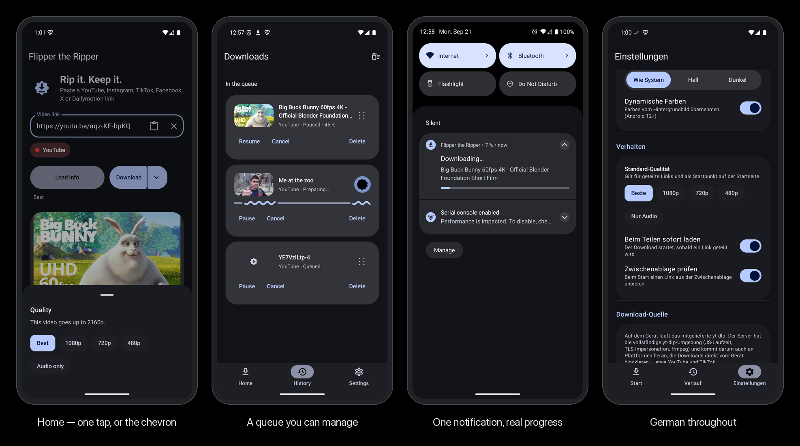
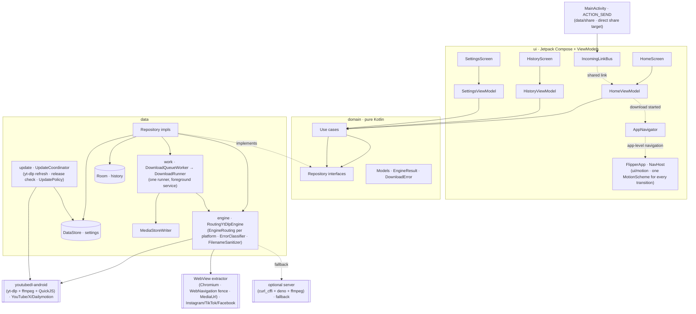

<div align="center">


# 🎬 Flipper the Ripper

**A modern, open-source Android app to download publicly accessible videos from YouTube, Instagram, TikTok, Facebook, X and Dailymotion.**

[](https://github.com/pepperonas/flipper-the-ripper/releases/latest)
[](app/src/test)
[](app/src/main/kotlin)
[](app/src/test)

[](https://github.com/pepperonas/flipper-the-ripper/actions/workflows/ci.yml)
[](https://github.com/pepperonas/flipper-the-ripper/actions/workflows/release.yml)
[](app/src/androidTest)
[](https://github.com/pepperonas/flipper-the-ripper/actions/workflows/ci.yml)
[](#-download)
[](#-download)
[](#-the-download-engine--and-why)
[](#%EF%B8%8F-build)
[](#-features)
[](app/src/main/res/values-de/strings.xml)
[](https://kotlinlang.org)
[](https://developer.android.com/jetpack/compose)
[](https://m3.material.io/blog/m3-expressive-motion-theming)
[](app/build.gradle.kts)
[](app/build.gradle.kts)
[](config/detekt/detekt.yml)
[](CHANGELOG.md)
[](CONTRIBUTING.md#commit-messages)
[](https://github.com/pepperonas/flipper-the-ripper/commits/main)
[](https://github.com/pepperonas/flipper-the-ripper/commits/main)
[](https://github.com/pepperonas/flipper-the-ripper/issues)
[](https://github.com/pepperonas/flipper-the-ripper)
[](https://github.com/pepperonas/flipper-the-ripper/releases/latest)
[](https://github.com/pepperonas/flipper-the-ripper/releases)
[](https://github.com/pepperonas/flipper-the-ripper/stargazers)
[](https://github.com/pepperonas/flipper-the-ripper/forks)
[](LICENSE)

[](https://www.paypal.com/donate/?business=martin.pfeffer@celox.io&currency_code=EUR&item_name=Flipper%20the%20Ripper)

</div>

---

> [!IMPORTANT]
> **Only download content you have the right to save.** Flipper the Ripper is intended for
> **publicly accessible** content and for personal, lawful use. It does **not** bypass DRM,
> paywalls, or access restrictions. Please respect the terms of service of each platform and
> applicable copyright law. See [Legal & responsible use](#-legal--responsible-use).

## 📸 Screenshots



<sub>Material 3 **Expressive** throughout: spring-based screen transitions, one drawn mark, a compact 64 dp navigation bar, and dynamic color in dark and light. Regenerate the strip from raw captures with `python3 tools/mockups.py docs/screenshots/mockups.png shot.png:"Caption" …`.</sub>

## ✨ Features

- **Share integration** — tap *Share* in YouTube / Instagram / TikTok / Facebook / X / Dailymotion and pick **Flipper the Ripper**; the link is imported automatically. With auto-download on (the default) the download starts at once and the app opens **History with the new download at the top of the list**, queued or running, progress wave and all — you always see that it is happening. With auto-download off the app opens Home with the link filled in and the details loading. The app registers as a *direct* share target, so Android can offer it in the suggested row at the top of the sheet rather than only in the app list. Apps that draw their own in-app share sheet (TikTok among them) show a fixed set of destinations plus a *More* entry — the Android sheet, and the app, are one tap behind that.
- **Clipboard detection** — copied a link instead? On launch the app offers to download a supported URL found on the clipboard.
- **One-tap flow** — analyse → detect platform → resolve metadata → download, with as few taps as possible (auto-download on share is configurable).
- **Instagram sign-in (optional)** — some reels are only visible to a signed-in account. Sign in on **Instagram's own page** (*Settings → Instagram*) and the app can download the reels *your* account can see. The password is entered on Instagram, never touched by the app — only the resulting session cookie is kept, exactly as a browser does. Sign out anytime.
- **Material 3 Expressive motion** — every screen transition is built from the theme's spring `MotionScheme` in one place (`ui/motion/ScreenTransitions.kt`): lateral fade-through with a directional slide between tabs, shared-axis rise for child screens; reduced motion collapses it to a cut.
- **One drawn mark** — the app icon and every in-app sign share one shape: a soft Material *sunny* disc with a sharp download glyph punched through it, so the same path works coloured, outlined, tinted and as the Android themed icon.
- **Compact bottom bar** — M3 Expressive `ShortNavigationBar` (64 dp instead of 80 dp), full-height items, filled icon on the active tab.
- **English and German** — the whole interface is translated; a German phone gets German, everything else English. A test keeps the two files in step, including format placeholders.
- **About & support** — Settings → About shows version/build, links to celox.io, the source and the MIT licence, and a PayPal button.
- **Title-based filenames** — files are named after the video title (`Wie man Android Apps entwickelt.mp4`) with illegal characters sanitised.
- **Shows up everywhere** — saved via **MediaStore** into the public *Movies* folder; instantly visible in Gallery, Google Photos and file managers.
- **True background downloads** — keep going while the screen is locked, the app is minimised, or the device is rotated (WorkManager + foreground service).
- **A download queue you can actually manage** — downloads run **one at a time, in the order shown**, not several at once as before. The running one can be **paused** (the partly fetched file is kept, and resuming continues from that byte rather than starting over) and the waiting ones **dragged** into a different order. Finished entries swipe away. One notification for the batch ("Downloading… · 2 of 5"), not one per download.
- **Quality picker** — the Download button has a chevron that opens the options: **Best · 1080p · 720p · 480p · Audio only**, with a line under the button saying which one will happen. After *Load info* a tier the video does not reach is greyed out and the sheet says what the maximum is. A remembered default applies to shared links, so the one-tap path stays one tap.
- **Robust error messages** — private video, login required, region blocked, rate-limited, network error, invalid link, cancelled.
- **Material 3 Expressive** — spring-based motion physics (`MotionScheme.expressive()`), the expressive `LoadingIndicator`, emphasized typography, a spring-sliding segmented toggle, a split button with an options sheet, staggered list entrances, and expressive screen transitions. Dynamic color + light/dark, all guarded by `prefers-reduced-motion`.
- **Self-updating extractor** — yt-dlp is refreshed automatically (throttled, on app start *and*
  whenever a link is shared in), because platforms like YouTube break old extractors within months.
  A manual **Update yt-dlp** button remains in Settings.
- **Update notices** — when a newer release is published on GitHub, the Home screen shows a
  dismissible card linking straight to it.

## 📥 Download

Grab **`flipper-the-ripper-<version>.apk`** from the [**Releases**](https://github.com/pepperonas/flipper-the-ripper/releases/latest) page and sideload it. There is one file per release — 64-bit ARM, which is every Android phone sold since about 2016 — so there is nothing to pick. Install it over the existing app to update; every release since 1.0.0 is signed with the same key, and the Home screen tells you when a newer release exists.

Want to check what you downloaded? See [Releases & verification](#-releases--verification).

> **32-bit devices:** [1.8.3](https://github.com/pepperonas/flipper-the-ripper/releases/tag/v1.8.3) is the last release with an `armeabi-v7a` build. Since 1.9.0 the app ships 64-bit only — the 32-bit file drew under a tenth of all downloads, and offering two files mainly meant people installed the wrong one and got *"App not installed"*. The app does not show update notices on a 32-bit device.
>
> Not on Google Play by design — the Play Store prohibits video-downloader apps and runtime binary
> updates. Distribution is via GitHub Releases / F-Droid-style sideloading (like NewPipe and Seal).

## 🧠 The download engine — and why

Flipper the Ripper reuses the **policy and stability logic** of the desktop project
[`inspector-rust`](https://github.com/pepperonas) and runs it on Android.

`inspector-rust` is a Tauri desktop app that shells out to the external **`yt-dlp`** + **`ffmpeg`**
CLIs — there is no in-app extraction engine, and **stock Android cannot execute a `yt-dlp` binary
or run Python**. A literal 1:1 port is therefore impossible. What *is* portable is the thin policy
layer, which this app reimplements faithfully in Kotlin:

- **Platform detection** (host-substring match) → [`UrlParser`](app/src/main/kotlin/io/celox/flipperripper/domain/util/UrlParser.kt)
- **yt-dlp argument strategy** — prefer H.264 + m4a → mp4 for universal playback, audio = m4a q0, `--no-playlist`/`--no-mtime`, deliberately no pinned `player_client` (see the history note in `YtDlpArgsBuilder`), the `--` flag-injection guard, `%(title).100B [%(id)s]` naming → [`YtDlpArgsBuilder`](app/src/main/kotlin/io/celox/flipperripper/data/engine/YtDlpArgsBuilder.kt)
- **Error taxonomy** — `is_bot_block` / `looks_stale_or_rate_limited` plus private/region/unavailable/network buckets → [`ErrorClassifier`](app/src/main/kotlin/io/celox/flipperripper/data/engine/ErrorClassifier.kt)

The engine underneath is [**youtubedl-android**](https://github.com/JunkFood02/youtubedl-android),
which bundles the **real yt-dlp + ffmpeg** as native libraries — the same engine that powers apps like
Seal. That drives **YouTube, X and Dailymotion** on the device.

The browser-gated platforms need more than yt-dlp: **Instagram, TikTok and Facebook** fingerprint the TLS
handshake and hydrate the video URL with JavaScript, so they are handled by an on-device **WebView
extractor** (real Chromium) instead — see [How downloads are routed](#how-downloads-are-routed) for the
per-platform detail. The `inspector-rust` policy layer still governs the shared concerns (platform
detection, error taxonomy, naming) across all six.

### Decision: reuse vs. JNI vs. re-port

| Option | Verdict |
|--------|---------|
| **Port the Rust as a native lib (JNI)** | ❌ Not useful — `inspector-rust`'s core is an `rlib` (no `cdylib`) and contains **no extraction code**, only a ~50-line subprocess wrapper around external CLIs. Nothing to port. |
| **Subprocess yt-dlp (as on desktop)** | ❌ Impossible on non-rooted Android (no Python, no arbitrary `exec`). |
| **Bundle yt-dlp via youtubedl-android** ✅ | **Chosen.** Ships the real yt-dlp as a native payload; reuses the desktop policy layer verbatim; self-updates at runtime. Trade-off: larger APK (~50 MB per ABI) and ARM-only. |
| Pure-JVM extractor (NewPipeExtractor) | ❌ Strong for YouTube only; Instagram unsupported, TikTok fragile — would not meet the requirement. |

**Cookie fallback deviation:** the desktop `--cookies-from-browser` retry has no Android equivalent
(there are no desktop browser profiles). For Instagram the app instead offers an **in-app sign-in**
(*Settings → Instagram*): a WebView loads Instagram's own login page and the shared cookie store then
carries the session into the extractor — see [How downloads are routed](#how-downloads-are-routed).
Login walls that remain (e.g. YouTube age-gates) are surfaced as a typed `LoginRequired` error.

## 🏛️ Architecture

Clean Architecture + MVVM, single Gradle module with strictly layered packages (the `domain` layer
has **zero** Android dependencies and is 100%-unit-testable).



**Why WorkManager + a foreground service?** Downloads can take minutes and must survive process
death, minimisation and rotation. A bare service wouldn't give persistence, constraints, retry or
observable progress; WorkManager provides all of that and runs a foreground (`dataSync`) service
under the hood for the long-running case.

**Why exactly one worker (1.10.0).** Every download used to be its own WorkManager job, and
WorkManager ran several at once — so "queued" was a label with nothing behind it: what started next
was whatever the scheduler picked, the order in History was decoration, and offering to reorder it
would have been a lie. A single unique `DownloadQueueWorker` now drains `queueOrder` ascending and
hands each record to `DownloadRunner`, which is the old per-download logic unchanged. The state
lives only in the Room row — the card and the notification both read it, which is why neither can
show a different number than the other.

### Tech stack

Kotlin 2.0 · Jetpack Compose + **Material 3 Expressive** (material3 1.5.0-alpha, `graphics-shapes`) ·
MVVM + Clean Architecture · Coroutines + Flow · Hilt · Navigation Compose · Room · DataStore ·
WorkManager · Kotlin Serialization · Coil · youtubedl-android · **no XML layouts**.

> The Expressive component + motion APIs (`MotionScheme`, `MaterialShapes`, `LoadingIndicator`) are
> currently in the `material3:1.5.0-alpha` line, pinned explicitly (no Compose BOM) to the
> Compose 1.11 set that still targets `compileSdk 35` / AGP 8.7.

## 🛠️ Build

**Requirements:** JDK 17, Android SDK (compile/target **35**), Android Studio Ladybug+ (optional).

```bash
git clone https://github.com/pepperonas/flipper-the-ripper.git
cd flipper-the-ripper

./gradlew assembleDebug          # debug APK → app/build/outputs/apk/debug/
./gradlew testDebugUnitTest      # unit tests
./gradlew koverVerifyDebug       # coverage gate (≥ 80% line coverage)
./gradlew spotlessCheck detekt   # formatting + static analysis
./gradlew connectedDebugAndroidTest   # instrumentation tests (device/emulator, ARM image)
```

> The emulator must use an **ARM system image** — the bundled yt-dlp native libraries ship for
> `arm64-v8a` only (no x86/x86_64).

### Signed release builds

Signing is wired via `keystore.properties` (local, git-ignored) with an environment-variable
fallback for CI. See [Signing](#-signing).

```bash
./gradlew assembleRelease        # signed APK → app/build/outputs/apk/release/
```

## 🔏 Signing

Signing secrets are **never** committed (`*.jks`, `keystore.properties` are git-ignored).

- **Locally:** place `release.jks` + `keystore.properties` (`storeFile`, `storePassword`,
  `keyAlias`, `keyPassword`) in the project root.
- **CI / GitHub Actions:** the release workflow decodes the keystore from the `KEYSTORE_BASE64`
  secret and reads `KEYSTORE_PASSWORD`, `KEY_ALIAS`, `KEY_PASSWORD`. The build's signing config
  falls back to these environment variables when `keystore.properties` is absent.

Every release since 1.0.0 carries the same certificate:

```
SHA-256  1fc3904fd80eb8135b25ee15fe62ec3b74545eba360298c152f712646fd910cb
```

The release workflow checks the built APK against this digest before publishing, so a build signed
with any other key — which would refuse to install over the existing app for every user — never
reaches the Releases page.

## 🚀 Releases & verification

**Cutting a release** is three edits and a tag; everything after the tag is automated by the
[release workflow](.github/workflows/release.yml).

```bash
# 1. app/build.gradle.kts — bump versionCode and versionName
# 2. CHANGELOG.md        — add the "## [x.y.z] - YYYY-MM-DD" section (it becomes the release notes)
# 3. README.md           — the version and test-count badges (a unit test fails if they drift)
git commit -am "chore(release): vX.Y.Z" && git tag vX.Y.Z && git push origin main vX.Y.Z
```

The workflow then:

1. **Cuts the release notes out of `CHANGELOG.md`** (`scripts/release-notes.sh`) — the tag's section,
   verbatim, followed by an install and a verify block. A tag **without** a CHANGELOG section fails
   the workflow before anything is built; a release without notes is a mistake, not a page.
2. Builds the signed APK and names it `flipper-the-ripper-vX.Y.Z.apk` — one file, no architecture in the name.
3. **Verifies the signing certificate** against the digest in [Signing](#-signing) and refuses to publish on a mismatch.
4. Publishes the APK and a `SHA256SUMS.txt` to the GitHub Release.

**Verifying a download.** The digest of the certificate is the one thing that ties an APK to this
project, whatever site it came from:

```bash
apksigner verify --print-certs flipper-the-ripper-vX.Y.Z.apk | grep SHA-256
#   … 1fc3904fd80eb8135b25ee15fe62ec3b74545eba360298c152f712646fd910cb
sha256sum -c SHA256SUMS.txt        # the file itself, against the checksum shipped with the release
```

**Version codes.** The code Android sees is `versionCode × 10 + 2`. The scheme dates from the
two-ABI era (32-bit +1, 64-bit +2, so a newer build always out-ranked an older one) and stays
because every installed copy carries a code from it: 1.8.3 is 282, and a plain 29 for 1.9.0 would be
refused as a downgrade. Versioning follows [Semantic Versioning](https://semver.org/).

## 🗺️ Roadmap

- [x] Instagram sign-in for login-only reels (in-app WebView login → session reused by the extractor) — shipped in 1.2.11
- [x] X and Dailymotion — shipped in 1.4.0
- [x] Material 3 Expressive motion, one drawn mark, compact bottom bar — shipped in 1.5.0
- [x] German translation, guarded against drift — shipped in 1.8.0
- [x] Direct share target (suggested row of the share sheet) — shipped in 1.8.2
- [x] Release notes from the CHANGELOG, signature check in CI, single 64-bit APK — shipped in 1.9.0
- [ ] User-supplied cookie file for other login-gated platforms
- [x] Download queue management (pause/resume, reorder) — shipped in 1.10.0, design in [docs/specs](docs/specs/2026-09-16-queue-formats-subtitles-playlists-design.md)
- [x] Quality / format picker before download — shipped in 1.10.0 (same design)
- [ ] ~~Subtitle download~~ — dropped, not wanted
- [ ] ~~Playlist / multi-item downloads~~ — dropped, not wanted
- [ ] F-Droid distribution
- [ ] Additional platforms supported by yt-dlp (opt-in)
- [ ] Bundle a JS runtime + PO-token provider + `curl_cffi` impersonation to fully cover YouTube/TikTok (see Known limitations)

## ❓ FAQ

**Is this on Google Play?** No — Play policy prohibits these apps. Sideload the signed APK from Releases.

**Why is the APK ~50 MB?** It carries the real yt-dlp + ffmpeg + QuickJS native libraries for 64-bit ARM, so extraction runs on the phone without any server. (A build for every architecture would be roughly twice the size — which is why there is only the one.)

**I have a 32-bit phone.** Stay on [1.8.3](https://github.com/pepperonas/flipper-the-ripper/releases/tag/v1.8.3), the last release with an `armeabi-v7a` build. The app will not offer you newer versions.

**A download fails with "rate-limited or out of date".** The extractor changed upstream. Open **Settings → Update yt-dlp** to fetch the latest engine, then retry.

**An Instagram reel won't download / says it needs sign-in.** Some reels are only visible to a logged-in account. Go to **Settings → Instagram → Sign in to Instagram**, sign in on Instagram's own page, then retry. If your account can view the reel, the app can download it; a private account you don't follow stays inaccessible (that is Instagram's rule, not an app limit).

**YouTube says login/age-verification required.** That content is behind an auth/anti-bot wall that the app does not bypass; only content reachable without those walls is supported.

**Do TikTok and Facebook work?** Yes — both download on-device through the WebView (TikTok reads the URL from the page's rehydration JSON; Facebook from the public video page's HTML). Facebook videos that require a login, and private/age-restricted content, are not supported.

**Do X (Twitter) and Dailymotion work?** Yes — both go through the bundled yt-dlp on the device, using the platforms' guest APIs (no sign-in). Paste or share an `x.com` / `twitter.com` post link (the post itself must carry the video — a post that only *links* to a video elsewhere is not a video post) or a `dailymotion.com` / `dai.ly` link. Posts marked sensitive/NSFW, protected accounts and login-only content are not supported. Live broadcasts (X Spaces/live streams) resolve, but they are recordings of the whole stream and can be very large.

**Can I choose the quality?** Yes — the chevron beside *Download* opens **Best · 1080p · 720p · 480p · Audio only**, and the line under the button says which one will happen. After *Load info* the app knows what the video actually has, so a tier it does not reach is greyed out with the real maximum named. Your last choice becomes the default and is what shared links use, so sharing stays one tap. Instagram, TikTok and Facebook hand back a single file and offer no choice; the sheet says so instead of showing buttons that do nothing.

**Can I pause a download?** Yes, and resuming continues from where it stopped rather than starting over. A paused download keeps its place in the queue. Downloads run one at a time in the order you see; drag the handle on a waiting one to move it.

**Where do files go?** The public *Movies/FlipperTheRipper* folder (audio → *Music/FlipperTheRipper*), visible in Gallery/Photos/file managers.

**Does it work on an x86 emulator?** No — use an ARM system image or a physical device.

## 🧯 Troubleshooting

| Symptom | Fix |
|---------|-----|
| **"App not installed"** when sideloading | Three causes, in order of likelihood. **(1)** The file is an older release, or a 32-bit build from before 1.9.0, and the installed app has a higher version code — Android refuses downgrades; install the latest release from the Releases page. **(2)** A 32-bit-only phone: releases since 1.9.0 are 64-bit only, stay on 1.8.3. **(3)** The APK was signed with a different key than the installed copy — it did not come from this project's release workflow; verify it (see [Releases & verification](#-releases--verification)) and uninstall the foreign copy first if you trust the new one. |
| "The download engine is still initialising" | First launch unpacks the native payload; wait a few seconds and retry. |
| Downloads don't start in the background | Allow notifications and disable battery optimisation for the app. |
| Repeated failures on one platform | **Settings → Update yt-dlp**. |
| Nothing saved to the gallery | Check storage; on Android 7–9 grant the storage permission when prompted. |
| Build fails on `kspDebugKotlin` | Ensure `ksp.useKSP2=false` (set in `gradle.properties`). |
| A YouTube/TikTok download fails after the title/thumbnail loaded | The platform is gating the media fetch — see **How downloads are routed** below. Try **Settings → Update yt-dlp**, and switch download source: on-device uses your own IP, which YouTube blocks far less than a server's. |
| "Your IP address is blocked" / "Sign in to confirm you're not a bot" | Platform-side IP reputation, not an app fault. Switch to **On device** (your own connection) or try a different network. |
| An Instagram reel fails / `HTTP 403 from …cdninstagram.com` | The reel is login-only. **Settings → Instagram → Sign in to Instagram**, then retry. A 403 after signing in usually means your account can't view that reel (private account you don't follow). |

### How downloads are routed

The app picks the right engine per platform automatically — you do not choose a source by hand — and
falls back to a configured server if the primary can't get it:

| Platform | On-device primary | Why | Fallback |
|----------|-------------------|-----|----------|
| **YouTube** | bundled **yt-dlp** (default clients + QuickJS) | yt-dlp's maintained client rotation stays downloadable and the bundled QuickJS solves the JS challenges; runs from *your* IP, which YouTube blocks far less than a datacenter | server |
| **X** | bundled **yt-dlp** | yt-dlp's `twitter` extractor talks to X's guest-token GraphQL API — no browser check, no JS challenge; a public post's video comes as a plain progressive MP4 | server |
| **Dailymotion** | bundled **yt-dlp** | public metadata + HLS manifest; yt-dlp's native HLS downloader assembles the segments and the bundled ffmpeg fixes the container | server |
| **Instagram** | a hidden **WebView** (+ optional sign-in) | Instagram fingerprints the TLS handshake and hydrates the URL with JS — only a real browser gets through, and Android's WebView *is* Chromium; signing in unlocks login-only reels | server |
| **TikTok** | a hidden **WebView** | same browser check; the URL is read from the page's `__UNIVERSAL_DATA_FOR_REHYDRATION__` JSON and fetched with a `tiktok.com` Referer + the page cookies | server |
| **Facebook** | a hidden **WebView** (desktop UA) | the public video page embeds `browser_native_hd_url` in its HTML — but only the *desktop* page, so the extractor presents a desktop user-agent | server |

**How the engines differ:**

- **yt-dlp on the device** ships with a bundled **QuickJS** runtime (youtubedl-android ≥ 0.18) for
  yt-dlp's JS challenges, but has no `curl_cffi`, so it can do YouTube (yt-dlp's default client
  rotation — deliberately no pinned `player_client`, see `YtDlpArgsBuilder`), X and Dailymotion (both
  served by guest APIs), but *cannot* do Instagram/TikTok/Facebook at all — those require browser TLS
  impersonation.
- **The WebView** is real Chromium: it presents the genuine Chrome TLS fingerprint and runs the page's
  JS, then reads the direct video URL — each platform hides it differently:
  - **Instagram** — public reels are scraped from the embed's hydrated JSON; signed-in/gated reels go
    through Instagram's own media API (`/api/v1/media/<id>/info/`, media id derived from the shortcode),
    called *from inside the page* so it is same-origin: it carries your session, uses Chromium's TLS,
    isn't CORS-blocked, and returns the **authorized** URL (the embed's URL 403s for gated content).
  - **TikTok** — parsed out of the page's `__UNIVERSAL_DATA_FOR_REHYDRATION__` JSON (`video.playAddr`).
  - **Facebook** — read from `browser_native_hd_url` in the page HTML (desktop UA — the mobile page
    omits it).

  The resulting signed CDN URL is then downloaded with an ordinary HTTP client, replicating what the
  page's `<video>` element sends: the matching **site Referer** (instagram.com / tiktok.com /
  facebook.com — the wrong one is a 403), `Range`, `Sec-Fetch-*`, and the site's cookies (including the
  Instagram account session for logged-in reels). Because JavaScript cannot read cross-origin CDN bytes
  (CORS), the URL is captured in the page but the *bytes* are fetched natively.
- **The server** (optional, `backend/`) runs `curl_cffi`, a `deno` JS runtime and ffmpeg — it can catch
  what the device missed, **except** where the block is its datacenter IP (YouTube, TikTok), which is
  why it is only ever a fallback. (It is not signed in to your Instagram, so it cannot fetch login-only
  reels — that is exactly what the on-device sign-in is for.)

> **Reality (July 2026).** The blocks are of two kinds. **IP reputation:** YouTube answers datacenter
> IPs with *"Sign in to confirm you're not a bot"* and TikTok with *"Your IP address is blocked"* — so a
> server does not help those, and the device (your own IP) is the better route. **TLS fingerprint:**
> Instagram/TikTok refuse any non-browser client regardless of IP — which the on-device WebView solves
> for Instagram. TikTok remains hard everywhere; when the device can't get it and no server is
> configured, the app says so plainly instead of saving a broken file.

**Settings → Download source** still lets you force the server as your preferred source (it then leads,
with the on-device engine as fallback).

Deploy the backend (systemd + nginx + TLS, `X-API-Key` auth) — see **[backend/README.md](backend/README.md)** —
then set the server URL + key in Settings (or bake them into a git-ignored `backend.properties`).

## 🧪 Testing

The suite has two halves, and the split is the point.

**Tests of behaviour** — `app/src/test`, plain JVM, no device. The `domain` layer has no Android
dependency at all; ViewModels run against fakes (`testing/Fake*Repository`); and every rule that
has ever gone wrong in production lives in a small pure object with its own test — `WebNavigation`
(which navigations the hidden WebView may follow), `MediaUrl` (decoding escaped media URLs),
`SharedText` (what counts as a shared link), `EngineRouting`, `ErrorClassifier`, `AppVersions`,
`UpdatePolicy`. When a bug is fixed, the rule that was wrong is extracted first and pinned second;
the test's KDoc names the incident it guards against.

**Drift guards** — tests that read a *file* and hold it to a *fact*, because the failure they catch
is silent: nothing crashes, nothing logs, the wrong thing just ships.

| Guard | Holds | Would have caught |
|---|---|---|
| `ReadmeBadgesTest` | the version, test-count and SDK badges against `build.gradle.kts` and the real test count | a stale badge (it has fired several times — that is its job) |
| `TranslationTest` | every English string has a German one, placeholders match, no orphans, nothing merely copied | one English sentence on a German phone |
| `ShareTargetRegistrationTest` | manifest filter ↔ `shortcuts.xml` ↔ `SharedText` — what the sheet offers, the app accepts, the activity reads | the share filter widened on one side only (v1.8.2) |
| `ReleaseArtifactsTest` | the ABI the build produces == the file the release workflow publishes == the file the README tells people to download | dropping or adding an ABI in one place |
| `DownloadRunnerContractTest` | the runner never writes a whole row back, reports every phase, does not block the engine, and pauses *before* it stops the engine | a running download reset to QUEUED; a pause deleting the file it exists to keep (both shipped) |
| `FlipperDatabaseMigrationTest` | a genuine old database still has its rows after the upgrade | the destructive fallback that would have wiped every user's history at the first schema change |
| `ChangelogTest` | a section exists for the version being built, dates are valid, versions descend | a tag with no release notes |
| `ReleaseNotesScriptTest` | `scripts/release-notes.sh` cuts exactly the tagged section out of the real `CHANGELOG.md`, and fails on an unknown tag | the release page showing the wrong version's notes |
| `SecurityPolicyTest` | permissions in `SECURITY.md` == `uses-permission` in the manifest; platform lists cover the `Platform` enum | the security policy omitting a permission or a platform |
| `SigningDocsTest` | the fingerprint in the docs is a well-formed SHA-256 and, where the keystore is present locally, the keystore's | a typo in the one string people verify against |
| `ProguardRulesTest`, `VectorDrawableTest`, `DesignTokensTest` | keep rules, icon geometry (a real path parser — the safe zone is measured, not eyeballed), spacing/size tokens | release-only R8 breakage; an icon outside the adaptive-icon safe zone |

**Instrumented tests** — `app/src/androidTest`, run on an ARM emulator in CI: the bottom bar's
measured height, the screen-transition timing (with a paused test clock, since `screenrecord`
cannot see a 300 ms spring), the clear-history dialog, MediaStore writes.

**The house rule: every new pin is mutated once.** A test that has never been seen red is not an
assurance — it may be checking its own fixture, a comment, or nothing. So each new test gets the
bug it guards against put back (the file's checksum is compared to prove the mutation actually
applied), the suite must go red, and only then is the pin kept. Eight of eight fired in 1.8.3;
thirteen of thirteen in 1.9.0 — but six of those first came back *green*, and the reason was the
probe, not the pins: the guards read files Gradle did not know as test inputs, so it had skipped
the task as up-to-date. That is now fixed in the build, and it is why a "blind" result is treated
as a suspicion against the probe before it is treated as a verdict on the test.

```bash
./gradlew testDebugUnitTest                  # the JVM suite
./gradlew connectedDebugAndroidTest          # instrumented (ARM emulator or device)
./gradlew koverVerifyDebug                   # ≥ 80 % line coverage, enforced in CI
```

## 📝 Changelog

The full history is in [CHANGELOG.md](CHANGELOG.md) ([Keep a Changelog](https://keepachangelog.com/en/1.1.0/)
format). The GitHub release page for each version shows that version's section verbatim — the
file is the single source of the notes, not a second copy of them.

- **1.9.1** — a shared link always shows its download: History, new card on top, running.
- **1.9.0** — one 64-bit APK per release (32-bit dropped, with the numbers), release notes cut from
  the CHANGELOG, signing-certificate check in CI, no update nag on devices that cannot install; the
  documentation brought back in line with the app it describes.
- **1.8.3** — a shared link opens Home, not History; shares labelled as any text type are read.
- **1.8.2** — the app is a direct share target; the SEND filter accepts every text type.

## 🤝 Contributing

Contributions are welcome! Please read [CONTRIBUTING.md](CONTRIBUTING.md) and the
[Code of Conduct](CODE_OF_CONDUCT.md). All CI checks (build, lint, detekt, unit tests, ≥ 80% coverage)
must pass — including the [drift guards](#-testing), which means a change to the manifest, the
strings, the ABI split or the documentation may need its counterpart updated in the same PR.
Security issues: see [SECURITY.md](SECURITY.md).

## ⚖️ Legal & responsible use

Flipper the Ripper is a tool for downloading **publicly accessible** content for **personal, lawful**
use. By design it:

- does **not** circumvent DRM, encryption, paywalls, or access controls;
- does **not** store platform credentials and requests only minimal permissions;
- surfaces (rather than works around) login/region walls.

You are responsible for complying with the **terms of service** of each platform and with
**copyright** and other applicable laws in your jurisdiction. Downloading copyrighted material
without permission may be unlawful. The authors accept no liability for misuse. If you are a
rights holder with a concern, please open an issue or contact the maintainer.

## 📄 License

MIT © 2026 **Martin Pfeffer**. See [LICENSE](LICENSE).

Built on the excellent [yt-dlp](https://github.com/yt-dlp/yt-dlp) and
[youtubedl-android](https://github.com/JunkFood02/youtubedl-android) projects.
